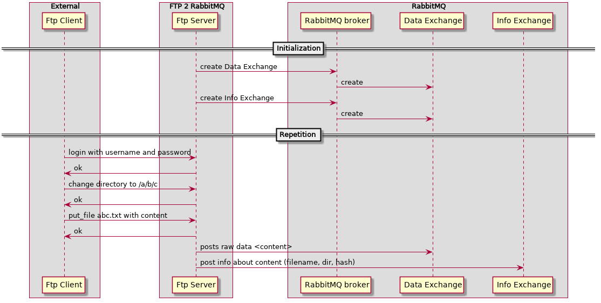

ftp2rabbitmq
============

Under development. Very unstable.

Design
------



Gettings started
----------------

Start RabbitMQ

```
docker run -d --rm -p 5672:5672 -p 15672:15672 rabbitmq:3.7-management
```

Start application

```
rebar3 shell
```

For development purposes you can create a client that listens to the queue.
Please note that `foobar` must be the same as the username when logging into
the ftp server.

```
rabbitmq2disk:start_link("D1", "ftp", "ftp_data1", "#").
rabbitmq2disk:start_link("D2", "ftp", "ftp_data2", "#").
```
